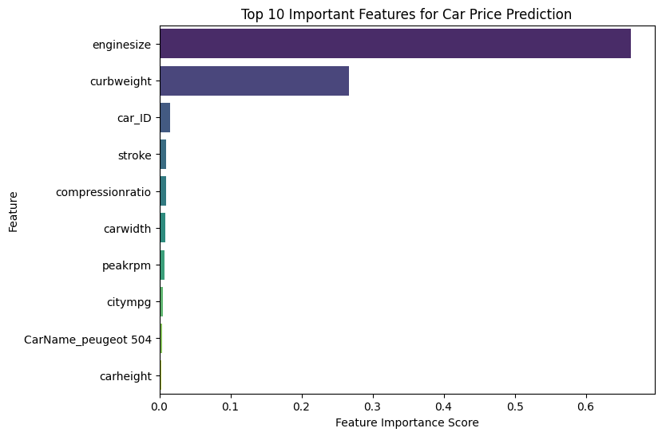

# 🚗 Car Price Prediction with Decision Tree Regression

This project explores how decision tree regression can be used to predict the prices of used cars.  
I wanted to see how well a simple decision tree performs, and how much improvement can be gained through hyperparameter tuning.  

---

## 📂 Dataset
For this project I used a public dataset of used cars.  
The dataset includes features like brand, year, mileage, fuel type, and engine size — all of which play a role in determining car prices.  

---

## ⚙️ Workflow
1. Load and clean the dataset.  
2. Split the data into training and test sets.  
3. Train a baseline decision tree regressor.  
4. Evaluate baseline performance (R², MAE, RMSE).  
5. Perform hyperparameter tuning with cross-validation (GridSearchCV).  
6. Retrain the model with the best parameters.  
7. Evaluate the tuned model and compare results.  
8. Visualize feature importance and actual vs predicted prices.  

---

## 📊 Results

I started with a baseline decision tree regressor using default settings. Then I tuned the model with cross-validation to find the best combination of parameters.  

The tuned model performed noticeably better:  

| Model                  | R²    | MAE ($) | RMSE ($) |
|------------------------|-------|---------|----------|
| Baseline Decision Tree | 0.867 | 2098    | 3245     |
| Tuned Decision Tree    | 0.913 | 1652    | 2619     |

After tuning, the model explained more variance in car prices and reduced prediction errors by around **21%**.  

---

## 📈 Visuals
-  **Feature Importance**: Highlights which car attributes have the biggest impact on price.  
  
- **Actual vs Predicted plot**: shows how close predictions are to real values.  
- **Decision tree diagram** (truncated for readability).  

---

## 🚀 Next Steps
- Try more advanced models (Random Forest, XGBoost).  
- Experiment with feature engineering (e.g., age of car instead of just year).  
- Deploy the model with a simple web app (Streamlit/Flask).  

---

## 📝 How to Run
1. Clone this repo  
   ```bash
   git clone https://github.com/your-username/used-car-price-prediction.git
   cd used-car-price-prediction
